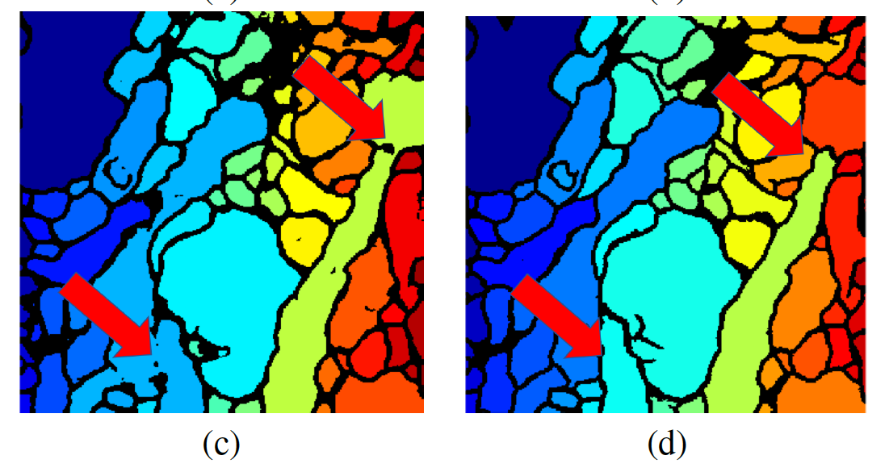

## 逐像素损失函数(Pixel-wise loss function)
顾名思义，这种损失函数可计算预测图像和目标图像的像素到像素损失。大多数损失函数（例如MSE或L2损失，MAE或L1损失，交叉熵损失等）都可以应用于预测变量和目标变量的每对像素之间由于这些损失函数会分别评估每个像素向量的类别预测，然后对所有像素进行平均，因此它们会向图像中的每个像素主张平等的学习。这些在图像的语义分割中特别有用，其中模型需要学习像素级的密集预测。

这些损失函数的变体也已用于诸如U-Net的模型中，其中采用加权像素交叉熵损失来解决用于图像分割时的类不平衡*问题。

    类不平衡是像素级分类任务中的常见问题。当图像数据中的各个类别不平衡时会出现这种情况。由于逐像素损失平均所有像素的损失，因此训练可以由最普遍的类别主导。

## 感知损失函数(Perceptual loss function)
感知损失函数，用于比较看起来相似的两个不同图像，例如同一张照片但在不同分辨率下移动了一个像素或相同图像。在这些情况下，尽管图像非常相似，但逐像素损失函数将输出较大的误差值。另一方面，感知损失功能比较图像之间的高级感知和语义差异。
考虑一个已经在ImageNet数据集中的数百万个图像上进行训练的图像分类网络（例如VGG），网络的第一层倾向于提取低级特征（例如线条，边缘或颜色梯度），而最终的卷积层会做出反应更复杂的概念（例如特定的形状和图案）。同样，在前几层中捕获的这些低级功能对于比较非常相似的图像很有用。
例如，假设您构建了一个网络，以根据输入图像构造超分辨图像。在训练期间，您的目标图像将是输入图像的超分辨率版本。您的目标是比较网络的输出图像和目标图像。为此，我们将这些图像通过预先训练的VGG网络，并提取VGG中前几个块的输出值，从而提取图像的低级特征信息。可以使用简单的像素损失比较这些低级特征张量

感知损失的数学表示

这里，V_j（Y）表示在处理图像Y时VGG网络的第j层的激活，并且具有形状（C_j，H_j，W_j）。我们使用平方的L2损耗比较地面真实图像Y和预测图像Y ^的激活，并通过图像的形状对其进行归一化。
如果要在损失计算中使用VGG网络的多个特征图，只需将多个js的L_j值相加即可

## 样式转移损失函数(Content - Style loss functions — Neural style transfer)

样式转移是将图像的语义内容呈现为不同样式的过程。给定内容图像（C）和样式图像（S），样式转移模型的目标是生成具有C内容和S样式的输出图像。

在这里，我们讨论了用于训练这种样式传递模型的内容样式损失函数的最简单实现之一。内容样式损失函数的许多变体已用于以后的研究中。下一节将讨论一个这样的损失函数，称为纹理损失
内容/样式丢失的数学表示
已经发现，CNN以较高级别捕获有关内容的信息，而较低级别则更关注单个像素值。
因此，我们采用CNN的一层或多层，并计算原始内容图像（C）和预测输出（P）的激活图-

类似地，可以通过将预测图像（P）和样式图像（S）的较低层特征图的L2距离计算为样式损失来计算样式损失。然后将所得的净损失函数定义为-

这里的alpha和beta是可以调整的超参数。

## (Texture loss function)
[Gatys等人（2016年）](https://zpascal.net/cvpr2016/Gatys_Image_Style_Transfer_CVPR_2016_paper.pdf)首次引入样式损失组件，以实现图像样式转移。
纹理损失是作为对感知损失的改进而引入的损失函数，特别适合于捕获图像样式。Gatys等人发现，我们可以通过查看激活或特征图（来自VGG网络）中值的空间相关性来提取图像的样式表示。这是通过计算Gram矩阵完成的-

语法矩阵（对于VGG网络的第1层）不过是矢量化特征图F_i和F_j（在第1层中）的内积。克矩阵可捕捉特征在图像不同部分同时出现的趋势

在此，G ^ l和A ^ l分别是模型输出的第l层和目标图像的第l层的样式表示。N_1是层l中不同特征图的数量，M_1是层l中特征图的体积（即通道*宽度*高度）。最后，E_l是层l的纹理损失
净纹理损失是所有纹理损失的加权总和，表示如下：

这里a是原始图像，x是预测图像。
    注意：尽管此处的数学看起来有些复杂，但应了解纹理损失只是应用于特征图的克矩阵的感知损失。

## 拓扑感知损失函数(Topology-aware loss function)
[Mosinska等人（2017）](https://arxiv.org/pdf/1712.02190.pdf)引入的最新文献中另一个有趣的损失函数是拓扑感知损失函数。可以将其视为感知损失的扩展，应用于分割蒙版预测。
Mosinska等人争辩说，在图像分割问题中使用的逐像素损失（例如交叉熵损失）仅依赖于局部度量，而不考虑拓扑的特征（例如连接的组件或孔的数量）。结果，传统的分割模型（例如U-Net）倾向于对薄结构进行错误分类。这是因为就像素损失而言，像素薄层的错误分类具有低成本。作为对逐像素损失的一种改进，他们建议引入一个惩罚项，以基于VGG-19网络生成的特征图（类似于感知损失）来考虑拓扑信息。

当存在例如由于树木的遮挡时，该方法在从卫星图像进行道路分割中也特别有用。
拓扑感知损失的数学表示

在这里，在RHS上，l（m，n）代表VGG19网络第n层中的第m个特征图。Mu是衡量像素损失和拓扑损失的相对重要性的标量。

## 对比损失/三重损失(Contrastive Losses / Triplet Losses)

三重损失是由[Florian Schroff等人](https://arxiv.org/pdf/1503.03832.pdf)介绍的。(FaceNet2015)[https://arxiv.org/pdf/1503.03832.pdf]，目的是建立一个数据集有限且规模较小的人脸识别系统（例如办公室中的人脸识别系统）。在这种情况下，传统的用于人脸识别的CNN架构始终失败。
Florian Schroff等人关注的事实是，在一个很小的人脸识别样本空间中，我们不仅必须正确识别人脸匹配，而且还要准确区分两个不同的人脸。为了解决这个问题，FaceNet论文提出了一种称为“ 暹罗网络”的概念。
在暹罗网络中，我们通过网络传递图像A，然后转换为较小的表示形式，称为嵌入。现在，在不更新网络任何权重或偏差的情况下，我们对其他图像B重复此过程并提取其嵌入。如果图像B与图像A属于同一个人，则它们的相应嵌入必须非常相似。如果它们是不同的人，那么它们对应的嵌入必须非常不同。
    重申一下，暹罗网络旨在确保特定人（锚）的图像比同一人（正）的图像更接近同一人的所有其他图像（负）。
为了训练这样的网络，他们引入了三重损失功能。考虑一个三元组-[锚，阳性，阴性]（见图）。这三张图片定义了三元组损失，如下所示：
定义距离度量d = L2范数
计算锚图像和正图像的嵌入之间的距离= d（a，p）
计算锚图像和负图像的嵌入之间的距离= d（a，n）
三重态损耗= d（a，p）— d（a，n）+偏移
三重态损失的数学表示

在这里，x^a->anchor ，x^p->positive和x^n->negative

注意：要实现快速收敛，对用于损耗计算的正确的三线态选择进行采样至关重要。FaceNet论文讨论了实现此目的的两种方法-脱机三重态生成和在线三重态生成。我们将在其他时间保留关于此主题的详细讨论。但同时，您可以参考[FaceNet论文](https://arxiv.org/pdf/1503.03832.pdf)。

## GAN损失函数(GAN Loss)
    生成对抗网络，最初由[Ian Goodfellow](https://arxiv.org/abs/1406.2661)等提出。[等人](https://arxiv.org/abs/1406.2661)（2014年），是迄今为止最流行的图像生成任务解决方案。GAN受到博弈论的启发，并采用对抗性方案，因此可以不受监督地训练它们。

GAN可以看作是一个两人游戏，我们将生成器（例如产生超分辨率图像）与另一个网络（鉴别器）进行对比。区分者的任务是评估图像是来自原始数据集（真实图像）还是由其他网络生成（伪图像）。鉴别器模型像其他任何深度学习神经网络一样进行更新，尽管生成器将鉴别器用作损失函数，这意味着生成器的损失函数是隐式的，是在训练过程中学习的。通常对于机器学习模型，收敛是在训练数据集上所选损失函数的最小化。在GAN中，收敛标志着两人游戏结束。相反，寻求在发生器和鉴别器损失之间达到平衡。

对于GAN，生成器和鉴别器是两个角色，轮流更新其模型权重。在这里，我们将总结一些用于GAN网络的损耗函数

1.最小-最大损失功能(Min-Max Loss function)

然而，实际上，发现发电机的这种损耗函数饱和。也就是说，如果它不能像鉴别器一样快地学习，鉴别器获胜，游戏结束，并且模型不能得到有效训练。

2.非饱和GAN损耗(Non-Saturating GAN Loss)

非饱和GAN损耗是对发电机损耗的一种修改，它克服了饱和问题，并做了细微的变化。生成器使生成的图像的鉴别器概率的对数最大化，而不是使生成的图像的鉴别器概率的对数最小化。

3.最小二乘GAN损失(Least squares GAN loss)
由[Xudong Mao等人(2016)](https://arxiv.org/pdf/1611.04076.pdf)引入，当生成的图像与真实图像有很大差异时，此损失函数特别有用，这会导致很小的梯度或消失的梯度，从而对模型的更新很少或没有更新。

4. Wasserstein GAN损失(Wasserstein GAN Loss)
由[Martin Arjovsky等人(2017)](https://arxiv.org/pdf/1701.07875.pdf)。他们观察到，传统GAN的动机是使真实图像和生成图像的实际概率分布与预测概率分布之间的距离最小化，即所谓的Kullback-Leibler（KL）散度。取而代之的是，他们建议在“ 地球移动者”的距离上对问题进行建模，该距离根据将一种分布转换为另一种分布的成本来计算两个概率分布之间的距离。
使用Wasserstein损失的GAN涉及将鉴别器的概念更改为批评器，该批评器的更新频率比生成器模型的更新频率高（例如，更新频率高五倍）。评论者使用真实值对图像评分，而不是预测概率。它还要求模型权重保持较小。计算分数，以便最大程度地分离真实图像和伪图像的分数之间的距离。Wasserstein损失的好处是，它几乎在任何地方都提供了有用的渐变，从而可以继续训练模型。

5.循环一致性损失(Cycle Consistency Loss)

    图像到图像的转换是一种图像合成任务，需要生成新图像，该新图像是对给定图像的受控修改。例如，将马翻译为斑马（或反之），将绘画翻译为照片（或反之），等等。

由[Jun-Yan Zhu等人(2018)](https://arxiv.org/pdf/1703.10593.pdf)在图像到图像翻译的上下文中引入。训练用于图像到图像翻译的模型通常需要成对的示例的大型数据集，这很难找到。CycleGAN是一种无需配对示例即可进行自动训练的技术。使用源和目标域中不需要任何方式相关的图像集合，以无监督的方式训练模型。
CycleGAN是GAN体系结构的扩展，它涉及同时训练两个生成器模型和两个鉴别器模型。一个生成器从第一域获取图像作为输入并输出第二域的图像，另一个生成器从第二域获取图像作为输入并生成第一域的图像。然后使用鉴别器模型确定所生成图像的可信度，并相应地更新生成器模型。
    周期一致性是这样的想法，即第一生成器输出的图像可以用作第二生成器的输入，而第二生成器的输出应与原始图像匹配。反之亦然。

CycleGAN 通过增加一个额外的损耗来测量第二个生成器的生成输出与原始图像之间的差以及相反的值，从而鼓励了循环一致性。该损失用作生成器模型的正则项，指导新域中的图像生成过程向图像转换过渡。

